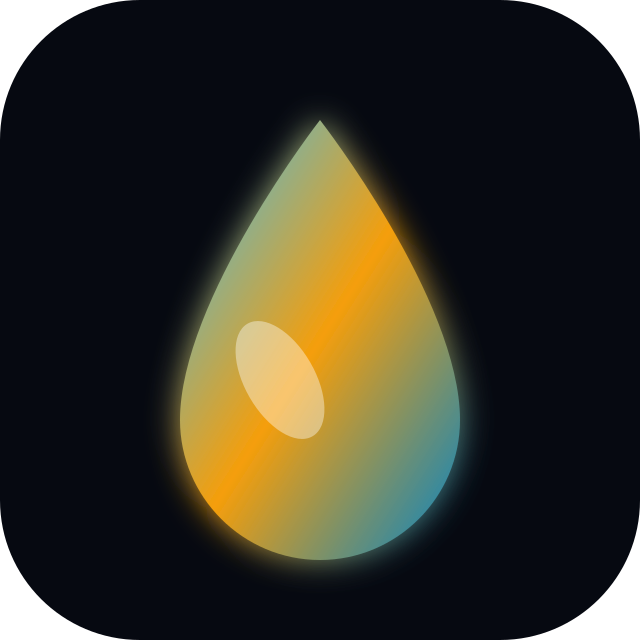
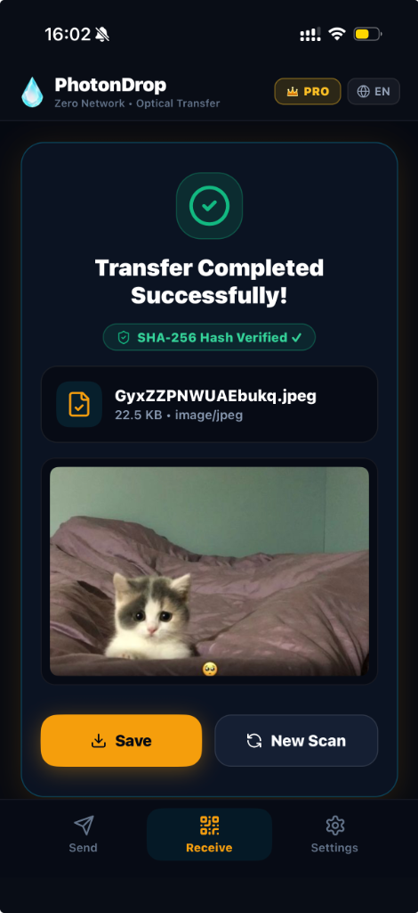
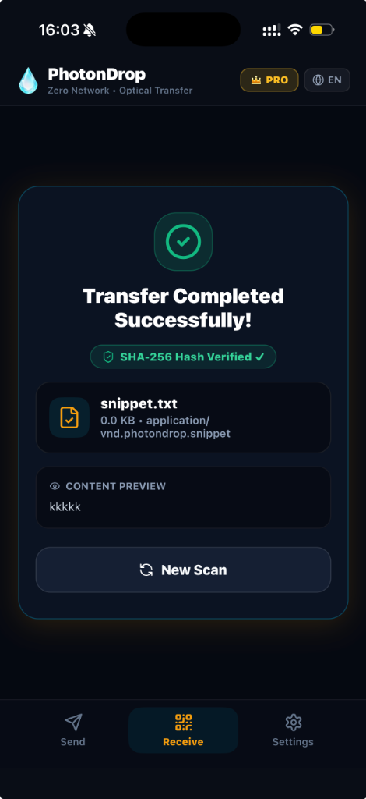

# 💧 PhotonDrop (Photon Transfer Protocol)

<div align="center">



### **Zero-Network • Air-Gapped • Optical Data Transmission**
*High-throughput, unidirectional file & data streaming via animated optical QR fountain codes.*

[](https://github.com/ummugulsunn)
[](https://github.com/ummugulsunn)
[](https://github.com/ummugulsunn)
[](https://github.com/ummugulsunn)

</div>

---

## 📌 Executive Summary

**PhotonDrop** is an air-gapped optical communication protocol and mobile/web application suite designed for **100% offline, zero-network file transfer**. 

Traditional air-gapped data transfers rely on physical USB drives or isolated storage media, introducing physical security risks and hardware friction. PhotonDrop replaces physical mediums with **high-frequency animated optical QR streams (Luby Transform Fountain Codes)**, allowing devices to transmit sensitive files, cryptographic credentials, photos, videos, and texts directly from screen to camera lens without Wi-Fi, Bluetooth, NFC, cellular connectivity, or cable tethering.

---

## ⚡ Core Technical Innovations

```
[ Sender (Web / Mobile) ]                                [ Receiver (iOS / Mobile) ]
       |                                                              |
 1. File Input (Blob/Buffer)                                          |
       ↓                                                              |
 2. DCF2 Container Packing (Magic, CRC, Type, Name)                   |
       ↓                                                              |
 3. Optional AES-256 Encryption & GZIP                                |
       ↓                                                              |
 4. Luby Transform (LT) Fountain Encoding                             |
       ↓                                                              |
 5. High-FPS Optical Stream Generation ─── [ Optical Waves ] ───> 6. Native iOS AVFoundation
                                                                      (Raw Byte Extraction)
                                                                           ↓
                                                                  7. LT Fountain Decoder
                                                                     (Dynamic Gaussian XOR)
                                                                           ↓
                                                                  8. SHA-256 Verification
                                                                           ↓
                                                                  9. In-Memory Preview & Save
```

### 1. 🌊 Luby Transform (LT) Fountain Coding
- Files are sliced into micro-payloads and ratelessly XOR-combined using custom soliton degree distributions.
- The receiver does not require an active feedback channel (simplex transmission). It collects arbitrary packets until Gaussian elimination resolves the original data.

### 2. 📸 Custom Low-Level iOS AVFoundation Byte Parser
- Standard mobile QR scanners decode payloads as text, corrupting high-entropy binary sequences (like compressed archives or encrypted streams).
- PhotonDrop features a custom native iOS pipeline extracting error-corrected raw codeword descriptors directly from `CIQRCodeDescriptor.errorCorrectedPayload`, preserving lossless binary fidelity at high frame rates.

### 3. 🛡️ Military-Grade Air-Gapped Security
- **Zero RF Emissions:** Radio frequencies (Wi-Fi, Bluetooth, Cellular) can be fully disabled (Airplane Mode).
- **Client-Side Cryptography:** End-to-end payload encryption with AES-256-GCM and PBKDF2 key derivation.
- **SHA-256 Integrity Verification:** Automatic cryptographic checksum calculation and validation upon stream completion.

### 4. 👁️ Real-Time Multi-Type Previews
- **Zero-Storage Footprint:** Files are assembled in memory and rendered (Images, Text Snippets, Documents) prior to local filesystem persistence.
- **Quick Action Workflow:** Direct clipboard copying, native Share Sheet integration, or saving to Photo Library / Files.

---

## 📱 Interface & Experience Showcase

<div align="center">
  <table>
    <tr>
      <td align="center" width="50%">
        <br/>
        <b>📷 Photo / Media Instant Preview & Save</b>
      </td>
      <td align="center" width="50%">
        <br/>
        <b>📝 Text Snippet & Crypto Key Stream</b>
      </td>
    </tr>
  </table>
</div>

---

## 🛠️ Technology Stack

| Layer | Technologies & Implementations |
| :--- | :--- |
| **Mobile Client** | React Native (Expo 51), TypeScript, Custom Hermes UTF-8 Polyfill Engine |
| **Native iOS Core** | Swift, AVFoundation, VisionKit, CoreImage Codeword Descriptors |
| **Web Client** | Vite, TypeScript, Canvas QR Streamer, Web Workers |
| **Data Engine** | Luby Transform (LT), Pako GZIP, js-sha256, Web Crypto API |
| **Design System** | Custom Dark Glassmorphism, Haptic Feedback, Modern Phosphor & Lucide Accents |

---

## 🔗 Showcase Links & References

- **Live Web Interface:** [PhotonDrop Web Portal](https://ummugulsunn.github.io/photondrop-app)
- **Repository Type:** Private Engineering Showcase
- **Lead Developer & Designer:** Ümmügülsün ([@ummugulsunn](https://github.com/ummugulsunn))

---

<div align="center">
  <sub>© 2026 PhotonDrop • Engineered for extreme security and air-gapped environments.</sub>
</div>
